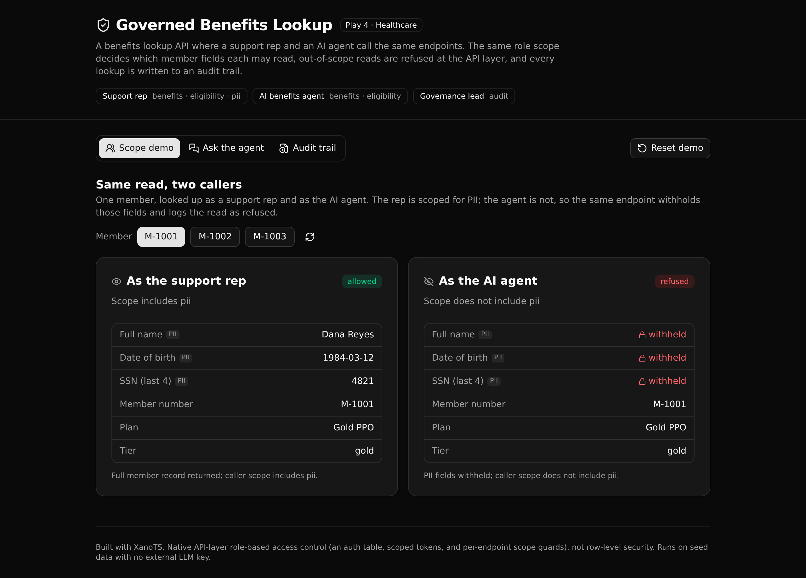

# Governed Benefits Lookup

**A permissioned, logged benefits lookup API where a support rep and an AI agent call the same endpoints, and the same role scope decides what each one may read.**

A health payer needs to answer member benefit questions from two kinds of caller: a person on the phone, and an AI assistant. Both should get correct answers. Only one should see member PII. This backend enforces that in one place. The same scope guard runs whether a human or the agent asks, out-of-scope reads are refused at the API layer, and every lookup is written to an audit trail a governance lead can read.



## What it demonstrates

This is Play 4 (Agent Intelligence Layer) for a healthcare payer. The point is data minimization for agents, enforced in one readable API layer:

- **One governed access rule, two callers.** A support rep is scoped for PII. The AI agent is not. The same `members/get` endpoint returns the full record to the rep and withholds `full_name`, `dob`, and `ssn_last4` from the agent. The business rule lives in one function both paths call, so it cannot drift between them.
- **The agent is bound by the caller's scope.** The `agent/ask` endpoint classifies a question, then runs the same governed lookup a person would, under the caller's own scope. The answer's values come from governed data, not from the model, so the agent cannot talk its way past a guard or invent a number.
- **Every lookup is audited.** Allowed and refused reads both write an audit row (who asked, in what role, which endpoint, the decision, and why). The audit trail is restricted to the governance lead role, so the agent writes to a log it cannot read.

This is API-layer role-based access control (an auth table, scoped tokens, and per-endpoint scope guards). It is not row-level security. It runs on seed data with no external LLM key: the assistant uses Xano's built-in model, and the governed-access proof does not depend on a live model at all.

**6 tables · 8 APIs · 5 functions · 1 agent**

## Repo layout

```
xano/
  index.ts                     registers the workspace
  seed-data.ts                 demo fixtures (one source of truth for tables + the seed endpoint)
  tables/                      callers (auth) · plans · members · benefits · member_benefit_usage · access_log
  functions/                   the governed business logic both people and the agent call
    log-access.ts              the single audit writer
    member-read.ts             member read with PII masking
    coverage.ts · eligibility.ts · remaining.ts
    guards.ts                  the shared benefits-scope guard
  api/                         auth · members · benefits · agent · audit · seed
  routes.gen.ts                generated route manifest the frontend imports
frontend/
  src/lib/api.ts               the one contract: paths and types derived from the query defs
  src/components/              Scope demo · Ask the agent · Audit trail
```

## API surface

| Method | Path | What it enforces |
| --- | --- | --- |
| POST | `/api:gblauth/login` | Authenticate a caller, mint a scoped token. |
| GET | `/api:gblmembers/get/{member_id}` | Read a member; PII withheld unless the caller has the `pii` scope. Logged. |
| GET | `/api:gblbenefits/get-coverage/{member_id}?category=` | Coverage summary. Requires the `benefits` scope. Logged. |
| POST | `/api:gblbenefits/check-eligibility` | Covered by the plan, and a referral on file when the benefit needs one. Logged. |
| GET | `/api:gblbenefits/get-remaining-limit/{member_id}?category=` | Annual limit minus visits used. Requires the `benefits` scope. Logged. |
| POST | `/api:gblagent/ask` | Classifies the question, runs the governed lookup under the caller's scope. Logged. |
| GET | `/api:gblaudit/queries` | The audit trail. Restricted to the `governance_lead` role (403 otherwise). |
| POST | `/api:gblseed/run` | Reset the environment to the demo fixtures. |

## Quick start

Clone it, deploy it, and you have a live, governed backend in about a minute.

```bash
git clone https://github.com/xano-scratch/agent-benefits-lookup-api.git
cd agent-benefits-lookup-api
npm install
npx xanots login          # authenticate with Xano (one time)
npm run xano:deploy       # builds the frontend, deploys, self-seeds, prints the live URL
```

`npm run xano:deploy` deploys the backend and the frontend to one disposable Xano environment and seeds the demo data, so the ephemeral is browsable right away. Type-check the backend with `npm run typecheck`, and export the bundle with `npm run xano:export`.

### Demo callers

Three demo accounts, one per role. All use the password `demo1234` (public demo credentials, safe to share).

| Username | Role | Scope |
| --- | --- | --- |
| `rep` | Support rep | `benefits`, `eligibility`, `pii` |
| `agent` | AI benefits agent | `benefits`, `eligibility` |
| `gov` | Governance lead | `audit` |

The frontend signs all three in on load and runs the Scope demo, so the PII contrast is visible at once.

## FAQ

**Is this row-level security?** No. Access is decided at the API layer: a per-endpoint guard checks the caller's scope before any read runs. Nothing is enforced in the database rows.

**Does the agent see member PII?** No. The `agent` account has no `pii` scope, so the same read that returns full data to a rep withholds those fields from the agent, and the audit row marks the read refused.

**Does it need an LLM key?** No. The assistant runs on Xano's built-in model. The governed-access proof (scope guards and the audit trail) works through the direct endpoints and does not depend on a live model.

**Where is the business logic?** In `xano/functions/`. Each governed read is one function that both the human endpoints and the agent path call, so the rule is defined once and audited once.

---

Built with [XanoTS](https://github.com/xano/xanots). This is an experimental scratch app, not a production customer reference.
